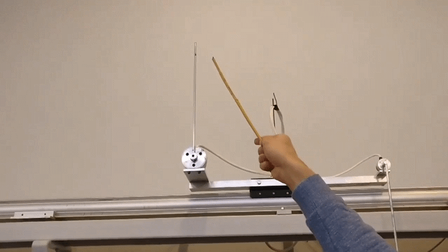

# InvertedKalmanPendulum: Stabilizing Inverted Pendulum with Observer-based Strategy

## Introduction
The InvertedKalmanPendulum project focuses on solving the classic problem of stabilizing an inverted pendulum using control engineering techniques. In this setup, the rotation point of a rigid rod pendulum is connected to a horizontally moving cart. The primary objective is to stabilize the pendulum such that its center of mass remains above the rotation point.

### Objectives
- Stabilize the inverted pendulum around its point of equilibrium.
- Utilize an observer-based strategy instead of velocity measurements.
- Design a swing-up strategy to lift the pendulum up.

## Project Overview
This project aims to demonstrate the principles of control system design in the context of an inverted pendulum setup. The control strategy involves implementing a Kalman filter to accurately estimate the system's state and applying an observer-based strategy to achieve stability. Furthermore, the project explores the use of a linear-quadratic regulator (LQR) to create a control feedback system for stabilizing the pendulum in the upright position.

## Conclusion
At the conclusion of the project, all requirements were achieved. 
1. **System Identification**: The physical characteristics of the system were identified, establishing a basis for mathematical modeling.
2. **Control System Design**: Control strategies were designed for stabilization.
3. **Observer Design**: An observer-based strategy was designed for state estimation.
4. **Swing-up Strategy Design**: A swing-up strategy was devised to elevate the pendulum, contributing to its stabilization.

The basic requirement of controlling the pendulum in the upright position was accomplished by deriving the state space representation of the system and creating a control feedback with matrix K using the LQR method. Additional requirements, such as controlling the system using only two position sensors and implementing a swing-up strategy, were also fulfilled. Despite some differences between simulated results and real-world performance, the controller with observer successfully stabilized the pendulum in the upright position. The swing-up strategy involved moving the cart in the opposite direction with high velocity whenever the pendulum passed through a certain zone, effectively providing the pendulum with more energy.

## Repository Contents
- `src/`: Contains the source code for the control system design and Kalman filter implementation.
- `docs/`: Documentation related to the project.
- `data/`: Data collected during the experiments.

## License
This project is licensed under the [MIT License](LICENSE).
